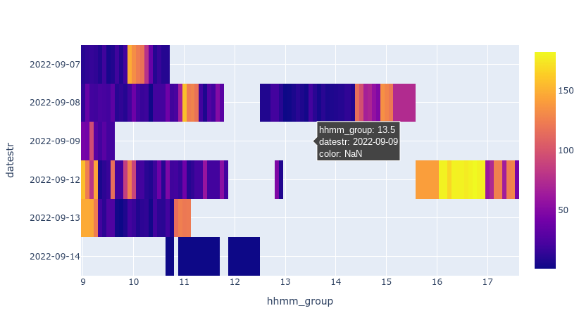

# webapi-sample-python

This is a sample to acquire data from JINS MEME web api (OAuth2).

## Install dependant library

pip install oauthlib 

## data_fetch.py

This sample acquires 15-second interval data and 60-second interval data according to the OAuth2 authorization code flow and saves them in CSV.

- client_id / client_secret / redirect_uri are obtained from the JINS MEME Developers app list and rewritten.
- Set the range of the date and time you want to fetch to the data start datetime (date_from) and data end datetime (date_to) in the parameters.
- Run `python data_fetch.py`.
- (You will see a message that the redirect URL is inaccessible because you have not set up a web server for the redirect URL, but this is not a problem)
- Copy and paste the URL(contains grant code) in the address bar into the Python REPL
- The data is retrieved, converted to a pandas dataframe, and saved as CSV (15s_interval_data.csv, 60s_interval_data.csv)

## data_fetch_auto.py

This is a version of the above version that eliminates the need to copy and paste URLs by additionally starting a local web server.

- client_id / client_secret / redirect_uri are obtained from the JINS MEME Developers app list and rewritten.
    - redirect_uri should be https://localhost:5001/ and the app registered.
    - If port:5001 is used, specify another port.
- Create a certificate for the local web server

```
openssl req -x509 -new -days 365 -nodes \
  -keyout localhost.pem \
  -out localhost.pem \
  -subj "/CN=localhost"
```

- Specify the data fetch date range in fetch_from / fetch_to with zero fill.
- Run `python data_fetch_auto.py`.
- The data is retrieved, converted to a pandas dataframe, and saved as CSV (15s_interval_data.csv, 60s_interval_data.csv)

## activities_heatmap.py

This sample reads a CSV of data at 60 second intervals and draws a heat map. Configurable items are as follows.

- _minutes: Object(string), how many minutes to summarize, a divisible number (5/10/15/20/30) for 60 is preferred
- _index: Object(string), "act" (overall index that includes the number of steps plus the number of head movements at low step counts) or "stp" (step count only)
- _scale: Object(string), "lin" or 'log
- _function: Object(string), "max" or "mean".

