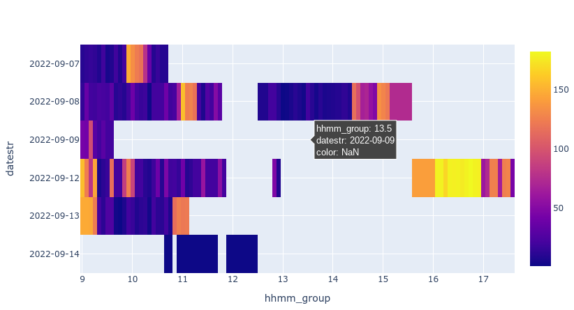

# webapi-sample-python

JINS MEME のWeb api(OAuth2)からのデータ取得をするサンプルです。

## モジュールのインストール

pip install oauthlib 

## data_fetch.py

OAuth2の認可コードフローに沿って15秒間隔データ、60秒間隔データを取得しCSVに保存するサンプルです。

- client_id / client_secret / redirect_uri はJINS MEME Developers のアプリ一覧から取得し、書き換えます
- paramのデータ開始日(date_from)とデータ終了日(date_to)に取得したい日時のレンジをセットします
- `python data_fetch.py` を実行します
- 認可コードフローなのでブラウザが開きアドレスバーにリダイレクトURLが表示されます(リダイレクトURLにWebサーバーを設定していないのでアクセスできないとの表示がでますが、問題ありません)
- アドレスバーのURL(grant codeが含まれます)をPythonのREPL(コンソールの入力画面で入力待ちになっています)にコピペします
- データが取得され、pandas dataframeに変換し、CSV(15s_interval_data.csv, 60s_interval_data.csv)として保存します

## data_fetch_auto.py

上記バージョンに、ローカルWebサーバーを追加で起動することでURLのコピペを不要にしたバージョンです。

- client_id / client_secret / redirect_uri はJINS MEME Developers のアプリ一覧から取得し、書き換えます
    - redirect_uri は https://localhost:5001/ とアプリ登録してください。
    - port:5001が使われている場合は他のポートを指定してください。
- ローカルWebサーバー用の証明書を作成します

```
openssl req -x509 -new -days 365 -nodes \
  -keyout localhost.pem \
  -out localhost.pem \
  -subj "/CN=localhost"
```

- fetch_from / fetch_to にデータ取得日付レンジを0埋めで指定してください
- `python data_fetch_auto.py` を実行します
- データが取得され、pandas dataframeに変換し、CSV(15s_interval_data.csv, 60s_interval_data.csv)として保存します

## activities_heatmap.py

60秒間隔データのCSVを読み込み、ヒートマップを描画するサンプルです。設定可能項目は以下になります。

- _minutes: Object(string), 何分毎にサマルか, 60で割り切れる数字が望ましい
- _index: Object(string), "act"(歩数に加え、低歩数時に頭部運動回数を当てた総合指標)か"stp"(歩数のみ)
- _scale: Object(string), "lin"か'log'
- _function: Object(string),  "max"か"min"

